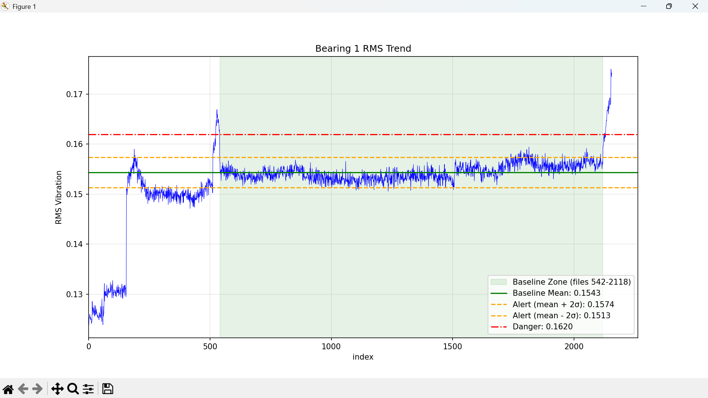

# Early Degradation Detection in Rotating Machinery using Vibration RMS Trend Analysis
Author: Vytamyn (CVN)

Date: July 13, 2027

## Abstract
This project aims to visualize early signals of potential degradation of the 
bearing by processing 2156 of accelerometer vibration data files from the 
NASA IMS bearing dataset. RMS values are computed to plot over moments of 
time, and they produce a continuous sharp rise above baseline before failure.

## Introduction
Rolling element bearings are critical components in rotating industrial 
machinery. Vibration analysis is a standard method for condition monitoring, 
with RMS (root-mean-square) acceleration serving as a proxy for vibration 
energy. A rising RMS trend indicates developing defects such as spalling, 
cracking, or wear. Detecting this rise early allows maintenance to be 
scheduled during planned downtime, avoiding costly emergency shutdowns.

## Composition
There are 6 support files and 1 main file to run the program as shown below:

1. convert_files.py
2. files_control.py
3. rms_cal.py
4. ims_plot.py
5. detector.py
6. report.py
7. main.py

All of them are written in Python. Version 3.0+ is strongly recommended. 
## Data
Data is provided publicly by NASA via https://data.nasa.gov/dataset/ims-bearings 
. There are 2156 files. Each file includes time-series accelerometer data.

In this project, only data of bearing 1 (out of 4) is executed. 
## Execution
To run the program, first of all, a user needs to navigate the folder path 
leading to the IMS vibration data and paste it as the variable for *sf* in 
*convert_files.py*. This way, they can convert all the files to csv files, 
which are convenient to execute and if they want to check things manually 
with Excel, csv can also help. 

Then, run the "main.py".

It might take some seconds to minutes (it shouldn't last more than 5 minutes 
unless your device is ancient, or you don't run the proper file) due to the 
heavy load of data points.

## Methodology
1. Converted raw files to CSV
2. Extracted Bearing 1, 1st test
3. Computed RMS per file
4. Established baseline from stable operating region
5. Applied statistical thresholds for alert and danger

## Results
| Metric                          | 				Value                 |
|---------------------------------|-------------------------------|
| Baseline Mean                   | 	0.1543466634608668       |
| Baseline Standard Deviation (σ) | 	0.0015241387918460       |
| Alert Threshold (mean + 2σ)     | 	0.1573949410445589       |
| Alert Threshold (mean - 2σ)     | 	0.1512983858771747       |
| Danger Threshold (mean + 5σ)    | 	0.1619673574200970       |

## Findings
RMS crossed the upper alert threshold at file index **2118-2119** and continued 
rising. At the file index **2129**, it passed the danger threshold. This 
provided an early warning of approximately **23.7 hours** or roughly 
**1 day** before catastrophic failure.

## Limitation
This program works on Bearing 1, test 1 only.

## App Demo
I also built a simple app for this project. One can upload CVS files, view the interactive graph, pinpoint the alert crossing index, generate a report, and download it.

[Watch the demo]

https://github.com/user-attachments/assets/2489221c-c1c4-4ade-a389-2f45fbf8146a

## Contact & Support
**Email**: vytamynv@gmail.com

**Report bug**: [Github Issues] https://github.com/vytamynv/ims-analysis/issues

## Copyright Notice

© 2026 Vytamynv. All Rights Reserved.

This project and its source code are made publicly visible for reference purposes only.

You are **NOT** permitted to:

- Copy, reproduce, or distribute any part of this code
- Modify, adapt, or create derivative works
- Use this code in any personal, commercial, or open-source project
without explicit prior written permission from the author.

For permission requests, please contact: vytamynv@gmail.com

